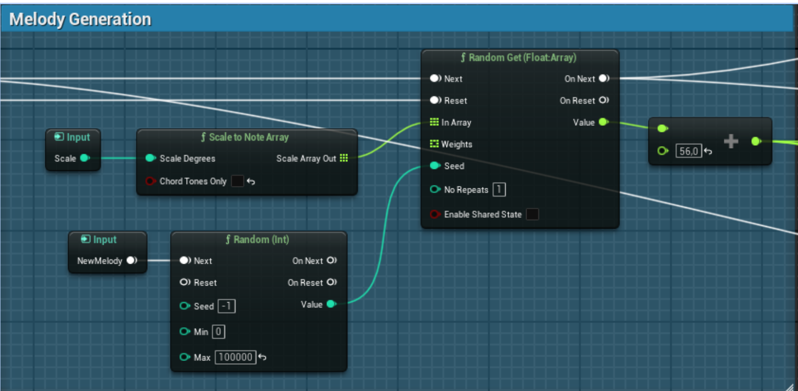
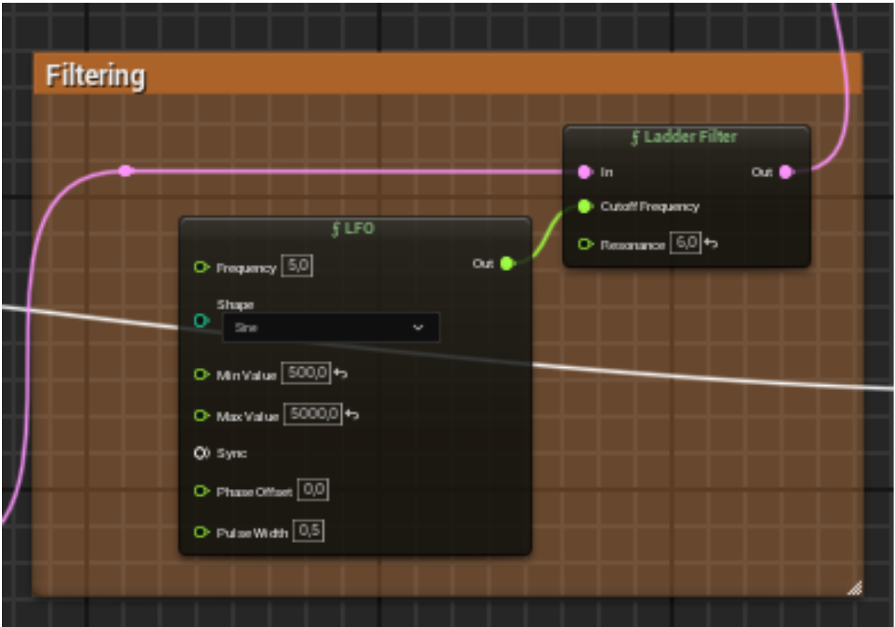
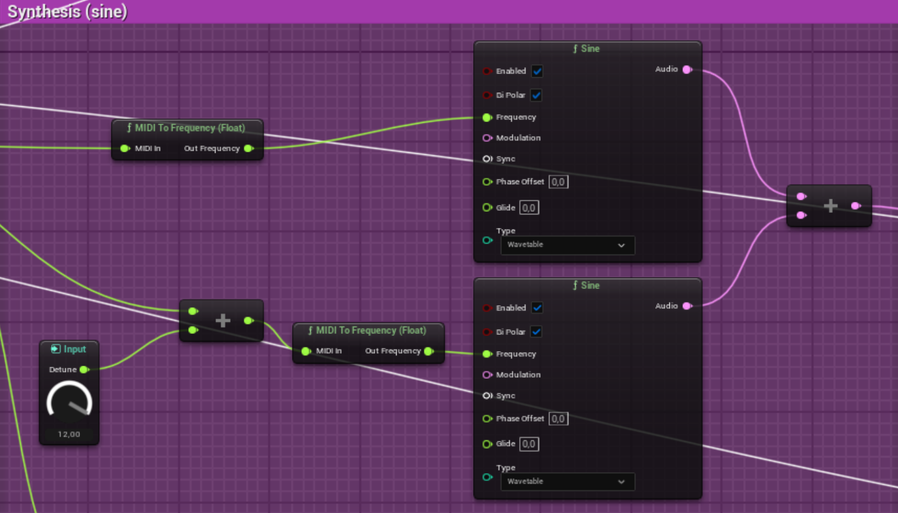

# Projet de Génération de Musique Procédurale

## Description

Ce projet concerne la génération de musique de manière procédurale. Il utilise MetaSounds pour créer des bandes sonores uniques et dynamiques. La musique générée peut s'adapter à diverses situations et humeurs, ce qui la rend idéale pour les jeux vidéo, les films et d'autres applications multimédia.

### Installation

1. Clonez ce dépôt: `git clone https://github.com/khial-lacerenza/procedural_music.git`
2. Ouvrez le projet avec Unreal Engine 5.3.2

### Utilisation

Pour commencer à générer de la musique, appuyez sur play dans Unreal Engine

### Caractéristiques

- Génération de musique dynamique avec MetaSounds d'Unreal Engine
- Paramètres personnalisables pour la génération de musique

## Explications & Objectifs

### Explications

Nous avons commencer par explorer les outils proposé par Unreal Engine et Unity pour déterminer ce que nous allions pouvoir faire dans le cadre de ce projet.

Unreal Engine propose un outil (MetaSounds) qui permet de manipuler differentes formes d'ondes, de créer des formes d'ondes facilement, mais aussi de mixer des signaux audio pour les utiliser en sortie.

Ce module propose tout un panel de fonctions très utile dans le domaine de la création musicale, il permet de créer facilement des LFO (Low Frequency Oscillator) mais aussi d'autres type de filtres, il y'a des fonction de trigger qui permettent de lancer des evenement de manière repeté, etc.

A ces outils s'ajoute les fonctions mathématique que propose Unreal en tant que moteur de jeux qui permettent de jouer avec les paramètres des filtres et des autres modules dont j'ai parlé plus haut.

Il y'a notemment une fonction Random qui permet de générer des nombres aléatoire dans une certaine intervale qui a été très utile pour moduler la fréquence de certains oscillateur que nous avons utilisé.

#### Methode utilisée

Nous avons donc utilisé des oscillateurs et des filtres pour créer de la musique grâce à metasounds voici quelques images qui présentes les liens entre les modules.

<b>Figure 1.</b> <i>Graph MetaSounds de la mélodie</i>
Nous pouvoir voir ici la partie génération de la mélodie qui en fonction de certains paramètres d'entrés nous renvoie une mélodie.
Nous utilisons un tableau de note généré avec un parmètre d'échelle puis nous récupèrons des notes aléatoirement dans ce tableau pour obtenir une mélodie.

<b>Figure 2.</b> <i>Graph MetaSounds de la partie filtration du son</i>
Cette partie du code permet de filtrer l'onde en entrée avec une forme d'onde particulière, nous utilisons ici un filtre qui dépend d'une fréquence mais cela fonctionne avec tout les type de filtre

<b>Figure 3.</b> <i>Graph MetaSounds de la partie synthese du son</i>
Dans cette section nous choisissons d'utiliser des formes d'ondes sinusoïdales pour générer du son mais nous aurions pu prendre des formes d'ondes carrée, triangulaire ou en dents de scie. 

Dans ces oscillateur nous envoyons plusieurs paramètre, ici une fréquence qui provient d'un signal midi. Nous faisons ensuite la somme des signaux des deux oscillateurs pour obtenir un signal moins brut. En général les sommes sont fait avec un plus grand nombre d'oscillateur et avec differents type de forme d'ondes pour donner un son plus organiques et moins brut.

## Sources

La chaîne youtube de [Ryan Hedgecock](https://www.youtube.com/watch?v=Le7OHZJ20pE)
La vidéo [How I Procedurally Generate Music (EXPLAINED)](https://www.youtube.com/watch?v=cQqEFNVPD1s) de Dennis Martensson
La documentation de [MetaSounds](https://docs.unrealengine.com/5.3/en-US/creating-procedural-music-with-metasounds/)
Article sur la [musique électronique](https://www.britannica.com/art/electronic-music) de l’encyclopédie britannica
[How to make electronic music the ultimate guide](https://blog.native-instruments.com/electronic-music/#what-is) de native-instruments.com